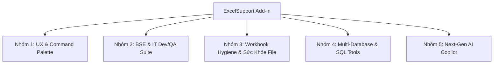

# 🗺️ ExcelSupport — Roadmap Đề Xuất Nâng Cấp Tính Năng (Feature Roadmap)

Tài liệu này tổng hợp toàn bộ các ý tưởng và đề xuất nâng cấp tính năng cho **ExcelSupport Add-in**, được phân loại theo từng nhóm nghiệp vụ chuyên sâu.

---

## 🧭 Bức Tranh Tổng Thể (Overview)

---

## 🚀 Chi Tiết Các Nhóm Tính Năng

### ⚡ 1. UX & Quick Productivity (Trải Nghiệm Người Dùng)

#### 1.1. Quick Command Palette (`Ctrl + Shift + P` kiểu VS Code / Raycast) — [Ưu tiên P0 - ✅ Đã hoàn thành]
* **Vấn đề giải quyết:** Add-in có hơn 30+ tính năng nằm rải rác trên 8 nhóm Ribbon và nhiều phím tắt khác nhau. Người dùng khó nhớ hết vị trí từng nút hay từng phím tắt.
* **Mô tả hoạt động:**
  - Nhấn `Ctrl + Shift + P` $\rightarrow$ Mở popup nổi giữa màn hình Excel (Modern Fluent/Slate Dark & Light Theme).
  - Thanh tìm kiếm mờ (Fuzzy Search): Gõ từ khóa bất kỳ (ví dụ: `dich`, `translate`, `compare`, `oracle`, `zenkaku`, `merge`, `clean`, `snapshot`).
  - Hỗ trợ hiển thị phím tắt đi kèm của từng chức năng, điều hướng bằng phím mũi tên `Up/Down` và bấm `Enter` để kích hoạt ngay.
  - Lưu lại **Lịch sử các lệnh dùng gần đây (Recent Commands)** lên đầu danh sách.

#### 1.2. Mini Floating Quick-Action Bar (Thanh tác vụ nổi theo con trỏ) — [P2]
* Khi quét chọn một vùng ô (Selection), xuất hiện thanh công cụ nhỏ gọn nổi nhẹ: *Copy Visible Only*, *Zenkaku/Hankaku*, *AI Quick Translate*, *Export Markdown*, *Trim Spaces*.

---

### 🇯🇵 2. Bộ Tiện Ích Chuyên Sâu Cho BSE / IT Dev & QA (Japan Offshore Suite)

#### 2.1. Spec to Code / DDL Generator (Sinh Code từ Thiết Kế Bảng Tính) — [Ưu tiên P0]
* **Vấn đề giải quyết:** Trong dự án Nhật, **Tài liệu thiết kế bảng (テーブル定義書)** hoặc **Thiết kế API/Giao diện (I/F 仕様書)** 100% viết bằng Excel. Dev/BSE phải gõ tay lại câu lệnh SQL `CREATE TABLE` hoặc viết Model C#/TypeScript/Java.
* **Mô tả hoạt động:**
  - Chọn vùng định nghĩa bảng (Tên vật lý, Tên logic Nhật, Kiểu dữ liệu, Length, Nullable, PK, Comment).
  - 1-Click sinh:
    - **SQL DDL:** `CREATE TABLE` / `ALTER TABLE` cho Oracle, PostgreSQL, MySQL, SQL Server (kèm đầy đủ `COMMENT ON COLUMN`).
    - **Entity / DTO Models:** C# Class, Java Entity, TypeScript Interface, Python Pydantic (có XML summary lấy từ tên tiếng Nhật).
    - **Mock JSON:** Dữ liệu mẫu JSON chuẩn cấu trúc phục vụ test API.

#### 2.2. QA Test Evidence Smart Paster (Tự Động Canh Khung Ảnh Bằng Chứng) — [Ưu tiên P1]
* **Vấn đề giải quyết:** Tester/QA khi chụp màn hình nghiệm thu (Evidence) phải dán ảnh vào Excel, sau đó dùng chuột kéo co giãn cho vừa ô, canh lề rất mất thời gian.
* **Mô tả hoạt động:**
  - Phím tắt (ví dụ: `Ctrl + Shift + V`): Tự động lấy ảnh từ Clipboard, dán vào ô đang chọn, **tự động tính toán Scale ảnh vừa khít bề rộng/chiều cao ô** (Fit to Cell Width/Height), khóa thuộc tính `Move and size with cells`.
  - Tùy chọn đóng dấu Watermark (Ngày giờ chụp, Tên Tester) ở góc ảnh.

#### 2.3. Test Case Status Consolidator & Dashboard — [P2]
* Tự động quét 10–50 sheet test case riêng lẻ trong Workbook, tổng hợp tỷ lệ Pass/Fail/Pending, xuất 1 Sheet Dashboard tổng hợp kèm thanh tiến độ (Progress Bar) trực quan.

---

### 🧹 3. Sức Khỏe File & Tối Ưu Bảng Tính (Workbook Optimizer & Hygiene)

#### 3.1. Workbook Health Check & Bloat Reducer (Cứu Tinh File Excel Bị Nặng) — [Ưu tiên P1]
* **Vấn đề giải quyết:** File Excel dùng lâu năm thường bị phình dung lượng (20MB – 100MB), mở rất chậm, giật đơ do **"Phantom Range / LastCell bug"** (Excel nhận nhầm vùng dữ liệu tới dòng 1,048,576), hoặc tồn tại hàng nghìn Style/Shape rác ẩn.
* **Mô tả hoạt động:**
  - Quét và reset `UsedRange` chuẩn xác, dọn sạch dòng/cột rác trống.
  - Quét và xóa các Shape/TextBox rác kích thước 0x0 pixel hoặc ẩn hoàn toàn.
  - Dọn dẹp Custom Styles trùng lặp (khắc phục lỗi *"Too many different cell formats"*).
  - Giảm dung lượng file từ 40% – 80%, mở nhanh tức thì.

#### 3.2. Sensitive Data / PII Masking (Ẩn danh hóa dữ liệu nhạy cảm) — [P2]
* Làm mờ hoặc sinh dữ liệu giả lập (Mask/Anonymize) cho Email, Số điện thoại, Tên người, Số thẻ ngân hàng khi gửi dữ liệu cho offshore hoặc bên thứ ba.

---

### 🗄️ 4. Cơ Sở Dữ Liệu Đa Nền Tảng (Multi-Database & SQL Tools)

#### 4.1. Hỗ Trợ Đa Database (PostgreSQL, MySQL, SQL Server, SQLite) — [P2]
* Mở rộng `OracleQuickQueryDialog` và `OracleTableCompareDialog` thành bộ công cụ Universal DB Query & Schema Compare đa hệ quản trị CSDL.

#### 4.2. Excel Range to SQL INSERT / MERGE Script Generator — [Ưu tiên P1]
* Chọn vùng bảng tính $\rightarrow$ Sinh script `.sql` chứa các câu lệnh `INSERT INTO ...` hoặc `MERGE INTO ... (Upsert)` chuẩn cú pháp theo từng loại database.

---

### 🌟 5. Next-Gen AI Copilot (Document & Data Intelligence)

#### 5.1. AI Smart Data Analyst & Executive Insights — [P2]
* Quét chọn bảng dữ liệu $\rightarrow$ AI tự động phân tích: Key Findings, Anomaly Detection (giá trị bất thường), gợi ý và tự động vẽ biểu đồ phù hợp.

#### 5.2. AI Pattern Extractor & Flash Fill Pro — [P2]
* Trích xuất thông tin có cấu trúc từ văn bản thô (Log lỗi, JSON chuỗi, mã sản phẩm) chỉ bằng 1–2 dòng ví dụ mẫu.

#### 5.3. Chat With Sheet (Hỏi đáp trực tiếp với Sheet trong Task Pane) — [P3]
* Tab Chat trong Task Pane cho phép hỏi đáp bằng tiếng Việt tự nhiên với dữ liệu trong Sheet kèm link nhảy tới ô dữ liệu.

---

## 📊 Ma Trận Đánh Giá Ưu Tiên (Priority Matrix)

| STT | Tính năng | Đối tượng hưởng lợi | Giá trị nghiệp vụ | Độ phức tạp | Giai đoạn đề xuất |
|:---:|---|---|:---:|:---:|:---:|
| 1 | **Quick Command Palette (`Ctrl + Shift + P`)** | Toàn bộ người dùng | ⭐⭐⭐⭐⭐ | Trung bình | **Phase 1** |
| 2 | **Spec to Code / DDL Generator** | BSE, Dev, QA Nhật | ⭐⭐⭐⭐⭐ | Trung bình | **Phase 1** |
| 3 | **QA Test Evidence Smart Paster** | QA, Tester, Dev | ⭐⭐⭐⭐⭐ | Thấp - TB | **Phase 2** |
| 4 | **Workbook Health Check & Bloat Reducer** | Toàn bộ người dùng | ⭐⭐⭐⭐⭐ | Trung bình | **Phase 2** |
| 5 | **Excel to SQL INSERT/MERGE Script** | Dev, DBA | ⭐⭐⭐⭐ | Thấp | **Phase 2** |
| 6 | **AI Smart Data Insights & Flash Fill** | PM, Analyst, Lead | ⭐⭐⭐⭐ | TB - Cao | **Phase 3** |
| 7 | **Multi-Database Support (Postgres/MySQL)** | Backend Dev | ⭐⭐⭐⭐ | Trung bình | **Phase 3** |
