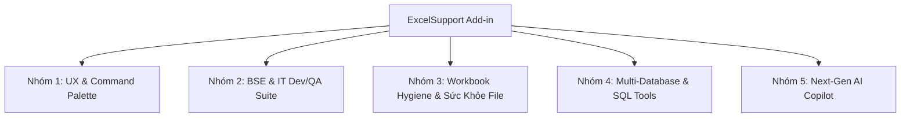

# 🗺️ ExcelSupport — Roadmap Đề Xuất Nâng Cấp Tính Năng (Feature Roadmap)

Tài liệu này tổng hợp toàn bộ các ý tưởng và đề xuất nâng cấp tính năng cho **ExcelSupport Add-in**, được phân loại theo từng nhóm nghiệp vụ chuyên sâu.

---

## 🧭 Bức Tranh Tổng Thể (Overview)

---

## 🚀 Chi Tiết Các Nhóm Tính Năng

### ⚡ 1. UX & Quick Productivity (Trải Nghiệm Người Dùng)

#### 1.1. Quick Command Palette (`Ctrl + Shift + P` kiểu VS Code / Raycast) — [Ưu tiên P0 - ✅ Đã hoàn thành]
* **Vấn đề giải quyết:** Add-in có hơn 30+ tính năng nằm rải rác trên 8 nhóm Ribbon và nhiều phím tắt khác nhau. Người dùng khó nhớ hết vị trí từng nút hay từng phím tắt.
* **Mô tả hoạt động:**
  - Nhấn `Ctrl + Shift + P` $\rightarrow$ Mở popup nổi giữa màn hình Excel (Modern Fluent/Slate Dark & Light Theme).
  - Thanh tìm kiếm mờ (Fuzzy Search): Gõ từ khóa bất kỳ (ví dụ: `dich`, `translate`, `compare`, `oracle`, `zenkaku`, `merge`, `clean`, `snapshot`).
  - Hỗ trợ hiển thị phím tắt đi kèm của từng chức năng, điều hướng bằng phím mũi tên `Up/Down` và bấm `Enter` để kích hoạt ngay.
  - Lưu lại **Lịch sử các lệnh dùng gần đây (Recent Commands)** lên đầu danh sách.

#### 1.2. Mini Floating Quick-Action Bar (Thanh tác vụ nổi theo con trỏ) — [Ưu tiên P2 - ✅ Đã hoàn thành]
* Khi quét chọn một vùng ô (Selection), xuất hiện thanh công cụ nhỏ gọn nổi nhẹ bên cạnh con trỏ: *Copy Visible Only*, *Zenkaku/Hankaku*, *AI Quick Translate*, *Export Markdown*, *Trim Spaces*, cùng các nút mở nhanh tài liệu dự án *TKCT*, *TKCB*, *UT*.
* Hỗ trợ Non-Activating Window (`WS_EX_NOACTIVATE`) bảo toàn 100% focus Excel, Dark/Light Theme, Toggle trên Ribbon và Command Palette (`Ctrl + Shift + P`).

---

### 🇯🇵 2. Bộ Tiện Ích Chuyên Sâu Cho BSE / IT Dev & QA (Japan Offshore Suite)

#### 2.1. Spec to Code / DDL Generator (Sinh Code từ Thiết Kế Bảng Tính) — [Ưu tiên P0]
* **Vấn đề giải quyết:** Trong dự án Nhật, **Tài liệu thiết kế bảng (テーブル定義書)** hoặc **Thiết kế API/Giao diện (I/F 仕様書)** 100% viết bằng Excel. Dev/BSE phải gõ tay lại câu lệnh SQL `CREATE TABLE` hoặc viết Model C#/TypeScript/Java.
* **Mô tả hoạt động:**
  - Chọn vùng định nghĩa bảng (Tên vật lý, Tên logic Nhật, Kiểu dữ liệu, Length, Nullable, PK, Comment).
  - 1-Click sinh:
    - **SQL DDL:** `CREATE TABLE` / `ALTER TABLE` cho Oracle, PostgreSQL, MySQL, SQL Server (kèm đầy đủ `COMMENT ON COLUMN`).
    - **Entity / DTO Models:** C# Class, Java Entity, TypeScript Interface, Python Pydantic (có XML summary lấy từ tên tiếng Nhật).
    - **Mock JSON:** Dữ liệu mẫu JSON chuẩn cấu trúc phục vụ test API.

#### 2.2. QA Test Evidence Smart Paster (Tự Động Canh Khung Ảnh Bằng Chứng) — [Ưu tiên P1]
* **Vấn đề giải quyết:** Tester/QA khi chụp màn hình nghiệm thu (Evidence) phải dán ảnh vào Excel, sau đó dùng chuột kéo co giãn cho vừa ô, canh lề rất mất thời gian.
* **Mô tả hoạt động:**
  - Phím tắt (ví dụ: `Ctrl + Shift + V`): Tự động lấy ảnh từ Clipboard, dán vào ô đang chọn, **tự động tính toán Scale ảnh vừa khít bề rộng/chiều cao ô** (Fit to Cell Width/Height), khóa thuộc tính `Move and size with cells`.
  - Tùy chọn đóng dấu Watermark (Ngày giờ chụp, Tên Tester) ở góc ảnh.

#### 2.3. Test Case Status Consolidator & Dashboard — [P2]
* Tự động quét 10–50 sheet test case riêng lẻ trong Workbook, tổng hợp tỷ lệ Pass/Fail/Pending, xuất 1 Sheet Dashboard tổng hợp kèm thanh tiến độ (Progress Bar) trực quan.

#### 2.4. Project Document & Quick Spec Launcher (Quản lý File Dự Án & Mở Nhanh TKCT / TKCB / Test Spec) — [Ưu tiên P0 - ✅ Đã hoàn thành]
* **Vấn đề giải quyết:** Trong dự án phần mềm/khách hàng Nhật Bản, tài liệu thiết kế (TKCT, TKCB, Chỉ thị test) gồm hàng trăm/nghìn file phân bổ trong nhiều folder phức tạp. Khi đang xem ma trận WBS, backlog, test case hoặc bảng danh mục màn hình trên Excel, việc phải mở Windows Explorer tìm từng file tốn rất nhiều thời gian.
* **Mô tả hoạt động & Luồng người dùng (User Flow):**
  - **Quản lý theo Profile Dự Án (Project Profiles):**
    - Cấu hình linh hoạt theo từng dự án (Project A, Project B...). Lưu trữ tại `%APPDATA%\ExcelSupport\project_profiles.json`.
    - Mỗi Profile gồm: Tên dự án, Thư mục gốc (Root Folder), Thư mục TKCT (Detailed Design), Thư mục TKCB (Basic Design), Thư mục Chỉ thị Test (Test Spec).
    - Cho phép chọn Profile đang kích hoạt (Active Project Profile) dễ dàng từ Ribbon hoặc popup cài đặt.
  - **Kích hoạt nhanh từ Cell qua Phím tắt (Hotkeys):**
    - Người dùng chọn ô chứa Screen ID, Table ID, Program ID hoặc Tên chức năng (ví dụ: `SCR_001`, `M_USER`, `B_CALC_01`).
    - `Ctrl + Shift + D`: Tìm và mở **TKCT (Detailed Design)**.
    - `Ctrl + Shift + B`: Tìm và mở **TKCB (Basic Design)**.
    - `Ctrl + Shift + J`: Tìm và mở **Chỉ thị Test (Test Spec)**.
  - **Cơ chế tìm kiếm thông minh (Smart Search Engine):**
    - **Quét đệ quy (Recursive Search):** Quét toàn bộ thư mục chỉ định và tất cả thư mục con bên trong (phù hợp khi dự án chia folder theo Module/Subsystem).
    - **Khớp từ khóa (Contains Match):** Khớp linh hoạt tên file chứa từ khóa trong Cell (tự động trim khoảng trắng, chuẩn hóa tên).
    - **Hỗ trợ đa định dạng:** Tìm và mở các file `.xlsx`, `.xlsm`, `.xls`, `.docx`, `.pdf`, `.pptx`.
  - **Nhận diện Version & Hộp thoại chọn nhanh (Version Picker Popup):**
    - Tự động nhận diện version trong tên file bằng Regex (ví dụ: `_v1.0`, `_v1.1`, `_ver2.0`, `_20260915`).
    - **Nếu chỉ tìm thấy 1 file duy nhất:** Mở file trực tiếp ngay lập tức.
    - **Nếu tìm thấy nhiều file / nhiều version:** Hiển thị popup **Version Selector Dialog** nhỏ gọn giữa màn hình:
      - Danh sách version kèm Tên file, Thư mục chứa, Ngày sửa đổi (`Last Modified`), Kích thước file.
      - Tự động highlight và focus vào bản mới nhất (**Latest Version**).
      - Nhấn `Enter` hoặc phím số `1`, `2`, `3`... để mở ngay.
      - Tùy chọn **Mở dạng chỉ đọc (Read-Only)** để bảo vệ an toàn tài liệu thiết kế gốc không bị chỉnh sửa ngoài ý muốn.
  - **Tích hợp Ribbon & Command Palette:**
    - Nút quản lý trên Ribbon nhóm `grpJapanTools` và tích hợp lệnh vào Command Palette (`Ctrl + Shift + P`).

#### 2.5. Japanese Design Quick Formatter / Preset Styler (Chuẩn Hóa Format Tài Liệu Thiết Kế Nhật Bản) — [Ưu tiên P1 - ✅ Đã hoàn thành]
* **Vấn đề giải quyết:** Khi viết, biên dịch hoặc chỉnh sửa tài liệu Thiết kế chi tiết (TKCT - 詳細設計書), Thiết kế cơ bản (TKCB - 基本設計書) hay Test Spec cho khách hàng Nhật Bản, việc chuẩn hóa hiển thị các vùng ô/khối text theo đúng quy chuẩn dự án (Font chuẩn tiếng Nhật, cỡ chữ, màu chữ, màu nền header, viền ô, in đậm, in nghiêng, căn lề) thường phải thực hiện thủ công bằng tay rất tốn công và dễ lệch chuẩn giữa các thành viên.
* **Mô tả hoạt động & Tính năng chính:**
  - **Quản lý Preset Định Dạng Sẵn (Formatting Presets):**
    - Cho phép người dùng thiết lập và lưu sẵn các mẫu format (Preset) chuẩn phong cách tài liệu Nhật:
      - **Font & Size:** Lựa chọn các font tiếng Nhật thông dụng như `Meiryo UI`, `Yu Gothic UI`, `MS Gothic`, `MS Mincho`, font code `Consolas`, tùy chỉnh Size (9pt, 10pt, 11pt...).
      - **Màu sắc & Nền (Color & Fill):** Cấu hình màu chữ (Font Color), màu nền (Cell Fill / Background) theo mã màu HEX/RGB tùy chọn hoặc bảng màu chuẩn (tiêu đề xanh navy/xanh xám, warning vàng cam, note xám nhạt...).
      - **Kiểu chữ & Căn lề (Typography & Alignment):** In đậm (Bold), in nghiêng (Italic), gạch chân (Underline), căn lề ngang (Left/Center/Right), căn lề dọc (Top/Middle/Bottom), Wrap Text (tự ngắt dòng).
      - **Đường viền (Borders):** Thiết lập kẻ viền ô mỏng (Thin Border), viền ngoài đậm, hoặc viền chấm gạch theo chuẩn spec.
    - Cung cấp sẵn một số template phổ biến (ví dụ: *Header bảng TKCT*, *Item bắt buộc [Must]*, *Mã chương trình/Physical Name*, *Khối ghi chú/Note*, *Ô nội dung chuẩn*).
    - Lưu cấu hình preset vào JSON (`%APPDATA%\ExcelSupport\format_presets.json`), hỗ trợ Export/Import chia sẻ trong team.
  - **Quy trình Áp dụng Nhanh 1-Click (1-Click Fast Apply):**
    - Người dùng quét chọn một hoặc nhiều vùng ô (Selection / Multi-range) chứa text cần định dạng.
    - Nhấn nút format nhanh trên Ribbon (hoặc chọn Preset từ Dropdown trên Ribbon / kích hoạt từ Command Palette `Ctrl + Shift + P`).
    - Add-in áp dụng tức thì toàn bộ thuộc tính định dạng vào vùng đang chọn, tự động tối ưu hóa hiển thị chuẩn đẹp chỉ trong 1 thao tác.

---

### 🧹 3. Sức Khỏe File & Tối Ưu Bảng Tính (Workbook Optimizer & Hygiene)

#### 3.1. Workbook Health Check & Bloat Reducer (Cứu Tinh File Excel Bị Nặng) — [Ưu tiên P1]
* **Vấn đề giải quyết:** File Excel dùng lâu năm thường bị phình dung lượng (20MB – 100MB), mở rất chậm, giật đơ do **"Phantom Range / LastCell bug"** (Excel nhận nhầm vùng dữ liệu tới dòng 1,048,576), hoặc tồn tại hàng nghìn Style/Shape rác ẩn.
* **Mô tả hoạt động:**
  - Quét và reset `UsedRange` chuẩn xác, dọn sạch dòng/cột rác trống.
  - Quét và xóa các Shape/TextBox rác kích thước 0x0 pixel hoặc ẩn hoàn toàn.
  - Dọn dẹp Custom Styles trùng lặp (khắc phục lỗi *"Too many different cell formats"*).
  - Giảm dung lượng file từ 40% – 80%, mở nhanh tức thì.

#### 3.2. Sensitive Data / PII Masking (Ẩn danh hóa dữ liệu nhạy cảm) — [P2]
* Làm mờ hoặc sinh dữ liệu giả lập (Mask/Anonymize) cho Email, Số điện thoại, Tên người, Số thẻ ngân hàng khi gửi dữ liệu cho offshore hoặc bên thứ ba.

---

### 🗄️ 4. Cơ Sở Dữ Liệu Đa Nền Tảng (Multi-Database & SQL Tools)

#### 4.1. Hỗ Trợ Đa Database (PostgreSQL, MySQL, SQL Server, SQLite) — [P2]
* Mở rộng `OracleQuickQueryDialog` và `OracleTableCompareDialog` thành bộ công cụ Universal DB Query & Schema Compare đa hệ quản trị CSDL.

#### 4.2. Excel Range to SQL INSERT / MERGE Script Generator — [Ưu tiên P1 - ✅ Đã hoàn thành]
* **Vấn đề giải quyết:** Khi cần chuẩn bị dữ liệu thử nghiệm (Master data, test data) từ file Excel để nạp vào Database, Dev/DBA thường phải viết tay các câu lệnh `INSERT`, ghép chuỗi nối công thức `=CONCATENATE("INSERT INTO...")` thủ công rất dễ sai sót về định dạng ngày tháng, chuỗi ký tự unicode, hoặc phải dùng công cụ bên thứ ba.
* **Mô tả hoạt động:**
  - Chọn vùng bảng tính $\rightarrow$ Mở hộp thoại (Phím tắt `Ctrl + Shift + K`, nút trên Ribbon `grpAuditTools`, Command Palette `Ctrl + Shift + P`, hoặc Floating Action Bar).
  - Tự động nhận diện tên bảng từ tên Sheet, tự động đọc dòng tiêu đề và phân tích kiểu dữ liệu (Text, Number, Date/Timestamp, Boolean, Raw).
  - Hỗ trợ đa hệ quản trị cơ sở dữ liệu: **Oracle**, **SQL Server**, **PostgreSQL**, **MySQL**, **SQLite**, **Generic ANSI SQL**.
  - Đa dạng loại câu lệnh:
    - **Single-row INSERT**: Từng câu lệnh `INSERT INTO table (...) VALUES (...);` độc lập.
    - **Batch Multi-row INSERT**: Cú pháp nạp nhanh theo cụm batch (`VALUES (...), (...)` hoặc `INSERT ALL` cho Oracle).
    - **MERGE / Upsert**: So khớp theo khóa chính (PK) tự động cập nhật hoặc thêm mới (`MERGE INTO` cho Oracle/SQL Server, `ON CONFLICT` cho Postgres/SQLite, `ON DUPLICATE KEY UPDATE` cho MySQL).
    - **UPDATE**: Cập nhật giá trị các cột dữ liệu theo điều kiện `WHERE` khóa chính.
  - Tùy chọn an toàn: Gói khối Transaction (`BEGIN/COMMIT`), xử lý ô rỗng thành `NULL`, tiền tố `N'...'` cho chuỗi Unicode, kích hoạt `SET IDENTITY_INSERT` cho SQL Server.
  - Thao tác nhanh: Sao chép vào Clipboard (1-click), Lưu file `.sql`, hoặc chuyển tiếp thẳng sang **Quick SQL Query** để thực thi ngay trên Oracle.

#### 4.3. Multi-User Connection Profiles (Quản Lý Nhiều User Trong 1 Connection Profile) — [Ưu tiên P0  - ✅ Đã hoàn thành]
* **Vấn đề giải quyết:** Hiện tại, mỗi Connection Profile chỉ lưu được duy nhất 1 User/Password. Trong thực tế dự án, một cơ sở dữ liệu (Host/DB) thường có nhiều User với quyền hạn khác nhau (User Admin/Schema Owner để xem cấu trúc DDL, User Read-Only / Select để tra cứu an toàn, User Nghiệp vụ / Test...). Việc phải tạo nhiều Profile trùng Host/Port/Service chỉ để đổi User gây rườm rà và khó quản lý.
* **Mô tả hoạt động & Luồng người dùng:**
  - **Quản lý danh sách User trong Connection Profile Details:**
    - Trong hộp thoại cấu hình Profile, hỗ trợ danh sách nhiều tài khoản User (`List<OracleUserCredential>`).
    - Mỗi User gồm: Tên User (`Username`), Mật khẩu (`Password`), Vai trò / Ghi chú (`Role/Description` như *Schema Owner, Read-Only, App Test...*), Đánh dấu mặc định (`IsDefault`).
    - Cho phép **thêm tay nhiều User**, sửa, xóa, và chọn User mặc định.
    - **Mặc định khi tạo mới 1 Profile:** Tự động tạo sẵn **2 User** (ví dụ: `SYSTEM` / `Admin` và `APP_USER` / `Read-Only`).
    - Tương thích ngược: Các profile cũ sẽ tự động được migrate tài khoản hiện có thành User 1 và bổ sung thêm User 2.
  - **Lựa chọn User linh hoạt khi truy vấn dữ liệu:**
    - Tại màn hình **Quick SQL Query** và **Oracle Table Compare**: Bên cạnh ComboBox chọn Profile, bổ sung ComboBox **`Chọn User`**.
    - Khi đổi Profile $\rightarrow$ ComboBox User tự động nạp danh sách User tương ứng và chọn User mặc định.
    - Người dùng có thể chuyển đổi nhanh giữa các User chỉ với 1 click để thực thi câu lệnh SQL với quyền tương ứng.

#### 4.4. Quick SQL Query: Table Structure & Index Inspector (Truy Xuất Cấu Trúc Bảng, Cột & Index Chính/Phụ) — [Ưu tiên P0 - (Đã hoàn thành ✅)]
* **Vấn đề giải quyết:** Khi viết câu lệnh SQL hoặc kiểm tra dữ liệu trong Excel, Dev/BSE thường phải mở công cụ ngoài (như PL/SQL Developer, DBeaver, Toad) chỉ để tra cứu xem bảng có những cột nào, kiểu dữ liệu gì, cột nào là Khóa chính (PK), có các Index phụ nào để tối ưu câu query `WHERE`.
* **Mô tả hoạt động & Luồng người dùng:**
  - **Kích hoạt nhanh từ Quick SQL Query:**
    - Nút bấm **`🔍 Cấu Trúc Bảng (Table Structure)`** hoặc phím tắt `Ctrl + T` ngay trên thanh công cụ SQL Editor.
    - Tự động nhận diện Tên Bảng từ mệnh đề `FROM [TABLE_NAME]` trong câu lệnh SQL hiện tại, hoặc cho phép nhập/chọn bảng từ danh sách.
  - **Truy xuất & Hiển thị thông tin siêu dữ liệu chi tiết:**
    - **Danh Sách Cột (Columns):** Tên cột, Kiểu dữ liệu chuẩn hóa (`VARCHAR2(50)`, `NUMBER(10,2)`, `DATE`...), Trạng thái Nullable, Đánh dấu Khóa chính (**PK ⭐**), Giá trị mặc định (`Data Default`), và Chú thích cột (`Comments`).
    - **Index Chính & Index Phụ (Indexes & Keys):** Tên Index, Phân loại rõ ràng (**Index Chính / PK** vs **Index Phụ / Secondary Index**), Tính duy nhất (`UNIQUE` / `NONUNIQUE`), Danh sách các cột tham gia Index theo thứ tự (`Col1 ASC, Col2 DESC`), Trạng thái index (`VALID`).
  - **Tác vụ hỗ trợ tăng năng suất 1-Click:**
    - **`📋 Chèn SELECT vào Editor`:** Tự động sinh cú pháp `SELECT col1, col2, ... FROM table_name` chứa đầy đủ tên cột đưa vào ô soạn thảo SQL, tránh phải gõ tay từng tên cột.
    - **`📊 Xuất ra Sheet Excel`:** Xuất bảng đặc tả cấu trúc bảng (Table Spec) ra một Sheet Excel mới với định dạng bảng kẻ viền đẹp mắt, phục vụ lưu tài liệu hoặc đối soát.

---

### 🌟 5. Next-Gen AI Copilot (Document & Data Intelligence)

#### 5.1. AI Smart Data Analyst & Executive Insights — [P2]
* Quét chọn bảng dữ liệu $\rightarrow$ AI tự động phân tích: Key Findings, Anomaly Detection (giá trị bất thường), gợi ý và tự động vẽ biểu đồ phù hợp.

#### 5.2. AI Pattern Extractor & Flash Fill Pro — [P2]
* Trích xuất thông tin có cấu trúc từ văn bản thô (Log lỗi, JSON chuỗi, mã sản phẩm) chỉ bằng 1–2 dòng ví dụ mẫu.

#### 5.3. Chat With Sheet (Hỏi đáp trực tiếp với Sheet trong Task Pane) — [Đã hoàn thành ✅]
* Tab Chat trong Task Pane cho phép hỏi đáp bằng tiếng Việt tự nhiên với dữ liệu trong Sheet kèm link nhảy tới ô dữ liệu (`[A1]`, `[B2:D10]`), gợi ý công thức và chèn 1-click vào ô tính.

---

## 📊 Ma Trận Đánh Giá Ưu Tiên (Priority Matrix)

| STT | Tính năng | Đối tượng hưởng lợi | Giá trị nghiệp vụ | Độ phức tạp | Giai đoạn đề xuất |
|:---:|---|---|:---:|:---:|:---:|
| 1 | **Quick Command Palette (`Ctrl + Shift + P`)** | Toàn bộ người dùng | ⭐⭐⭐⭐⭐ | Trung bình | **Phase 1 (Đã hoàn thành ✅)** |
| 2 | **Project Document & Quick Spec Launcher** | BSE, Dev, QA Nhật | ⭐⭐⭐⭐⭐ | Trung bình | **Phase 1 (Đã hoàn thành ✅)** |
| 3 | **Spec to Code / DDL Generator** | BSE, Dev, QA Nhật | ⭐⭐⭐⭐⭐ | Trung bình | **Phase 1** |
| 4 | **Japanese Design Quick Formatter (Chuẩn hóa format TKCT Nhật)** | BSE, Dev, QA Nhật | ⭐⭐⭐⭐⭐ | Thấp - TB | **Phase 1 (Đã hoàn thành ✅)** |
| 5 | **QA Test Evidence Smart Paster** | QA, Tester, Dev | ⭐⭐⭐⭐⭐ | Thấp - TB | **Phase 2** |
| 6 | **Workbook Health Check & Bloat Reducer** | Toàn bộ người dùng | ⭐⭐⭐⭐⭐ | Trung bình | **Phase 2** |
| 7 | **Excel Range to SQL INSERT / MERGE Script Generator** | Dev, DBA, BSE | ⭐⭐⭐⭐⭐ | Thấp - TB | **Phase 2 (Đã hoàn thành ✅)** |
| 8 | **Multi-User Connection Profiles (Nhiều User trong 1 Profile)** | Dev, DBA, BSE | ⭐⭐⭐⭐⭐ | Thấp - TB | **Phase 2 (Ưu tiên P0)** |
| 9 | **Quick SQL: Table Structure & Index Inspector** | Dev, DBA, BSE | ⭐⭐⭐⭐⭐ | Trung bình | **Phase 2 (Ưu tiên P0) (Đã hoàn thành ✅)** |
| 10 | **AI Smart Data Insights & Flash Fill** | PM, Analyst, Lead | ⭐⭐⭐⭐ | TB - Cao | **Phase 3** |
| 11 | **Multi-Database Support (Postgres/MySQL)** | Backend Dev | ⭐⭐⭐⭐ | Trung bình | **Phase 3** |
